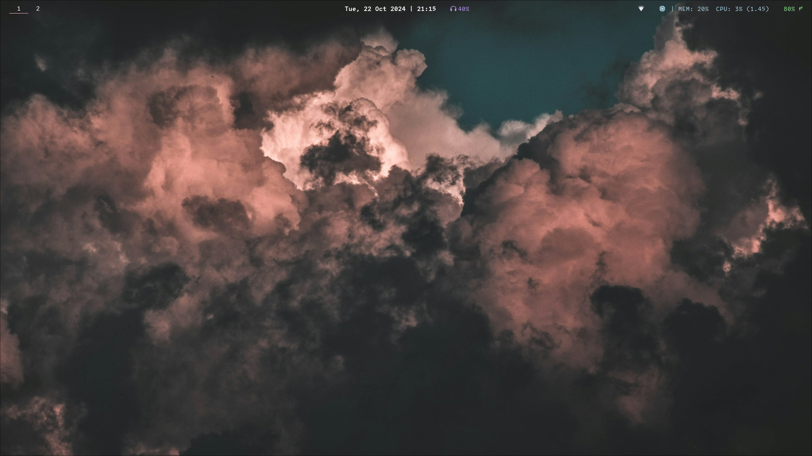
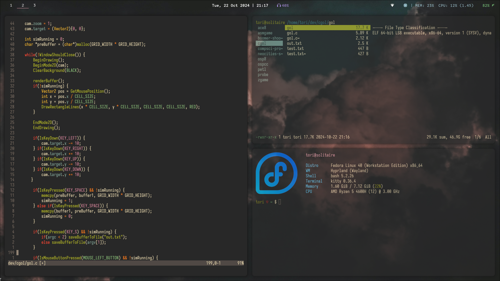
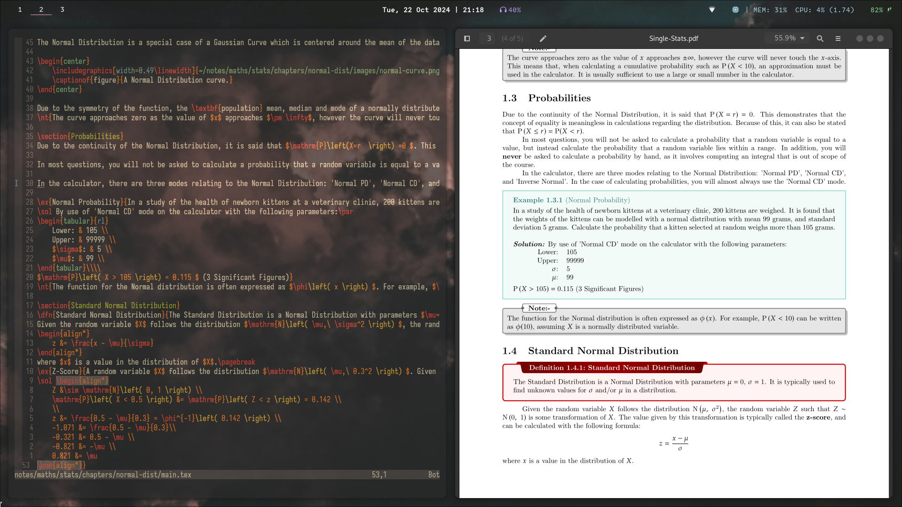

# My dotfiles
*This is my collection of dotfiles for my current linux installation. Please be aware that this configuration is specific for my requirements and may not satisfy your own.*

## System Information
- **OS:** Fedora Linux 40 (Workstation Edition) x86_64
- **Host:** HP Pavilion Gaming Laptop 15-ec1xxx
- **Window Manager:** Hyprland
- **Terminal:** Kitty
- **Shell:** Bash
- **Memory:** 8 GiB

## Contents
### Hyprland, Hyprlock, Hypridle, Hyprpaper
- [hypr/hypland.conf](hypr/hyprland.conf)
- [hypr/hyprlock.conf](hypr/hyprlock.conf)
- [hypr/hypridle.conf](hypr/hypridle.conf)
- [hypr/hyprpaper.conf](hypr/hyprpaper.conf)

### Waybar
- [waybar/config](waybar/config)
- [waybar/style.css](waybar/style.css)

### Bash
- [.bashalias](.bashalias)
- [.bashrc](.bashrc)

### Emacs
- [.emacs](.emacs)
- [.emacs.custom.el](.emacs.custom.el)

## Screenshots

